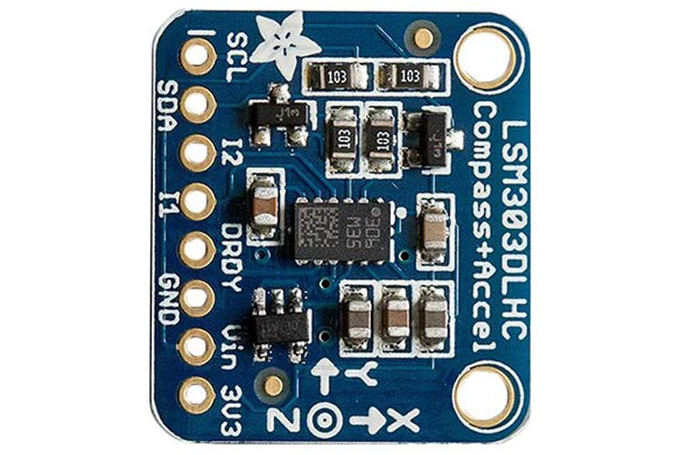

# Project Planning #

#### Our Problem: We want to find the speed at which a Potato Cannon shoots a potato ####

*In this section, we plan to clearly and accurately outline our ambitions for this project, and we hope to reach a solution to our problem.*

### Scope ### 

- - - - - - - - - - - - - - - - - - - - - - - - - - - - - - - - - - - - - - - - - - - - - - - - - - - - - - - - - - - - - - - - - - - - - - - - - - - - - - - - - - - - - 

 > **Our Project will be an arduos journey, but ultimately, it will be worthwile.**

Last year, in BACON, Harry and I brainstormed and came up with the idea of a Potato Cannon. We wanted to make a STEM related project that would be really cool to make and see the final result of. Our original plan last year was thwarted due to COVID-19, but we don't want that to stop us. We are aiming for a bigger and more complex project this time around. We plan to incorporate a Raspberry Pi and a Accelerometer to figure out how fast the capsule we shoot will go. It will be much more difficult, but the benefits outweigh the hardships. It's as they used to say in the 1980s, "No Pain, No Gain!"

### Schedule ###

- - - - - - - - - - - - - - - - - - - - - - - - - - - - - - - - - - - - - - - - - - - - - - - - - - - - - - - - - - - - - - - - - - - - - - - - - - - - - - - - - - - - - 

Weekly Timeline | Projected Goal
------------- | -------------
March 26  | Finish Planning - Potato Cannon with Accelerometer?
April 2  | Start working on project
April 9  | Spring Break
April 16  | Get parts of Potato Cannon
April 23  | Get any other parts of Potato Cannon we might need
April 30  | Start mini-assembly of cannon
May 7  | Find issues with protoype and Redesign
May 14  | Start Code
May 21  | Put Cannon Together and Continue Code
May 28  | Finish Code, Assemble Cannon, Test
June 4  | Final Assembly, make sure everything works
June 11  | Last Day - Check to see if anything we can do next year to further challenge us.

### Details ###
This project has given us the opportunity to continue, enhance, and complete our original design. We plan on modifying our original design to allow an accelerometer to measure the speed of the potato. Fortunatly most of our parts are sitting somewhere in the Simga Lab so that definitely helps.
Our orginal plan called for:
- 4” PVC pipe – 1.5 feet
- 2” PVC pipe – 4 feet
- 4” PVC threaded coupler
- 4” PVC cleanout cap
- 4” to 2” PVC adapter
- PVC primer
- PVC cement
- Saw
- Drill with 1/2” drill bit
- Potatoes
- Tape measure 
- Stick lighter
- Hairspray (not pictured)

We will add:
- Accelerometer  
- Raspberyy Pi

This was the video we were going to use to assemble the cannon itself
-			https://www.artofmanliness.com/articles/how-to-make-a-potato-cannon/
This Video shows how the cannon itself fires but we will use a spark plug instead of a lighter.
-   https://www.youtube.com/watch?v=nZb_PKEubB8

We plan on also adding a raspberry pi, accelerometer and a few custom 3D printed parts.
