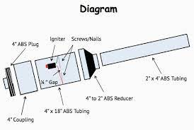
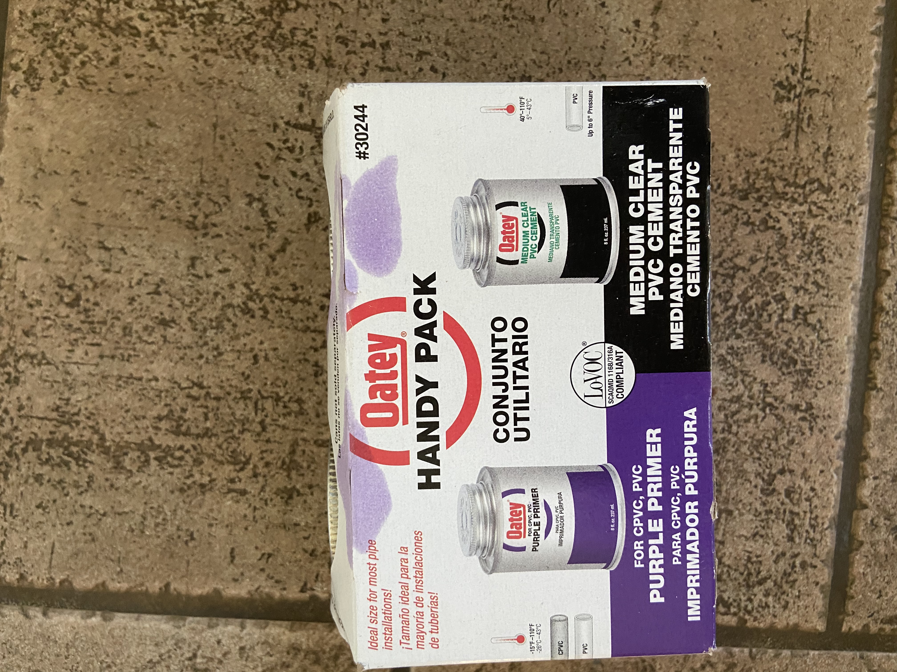
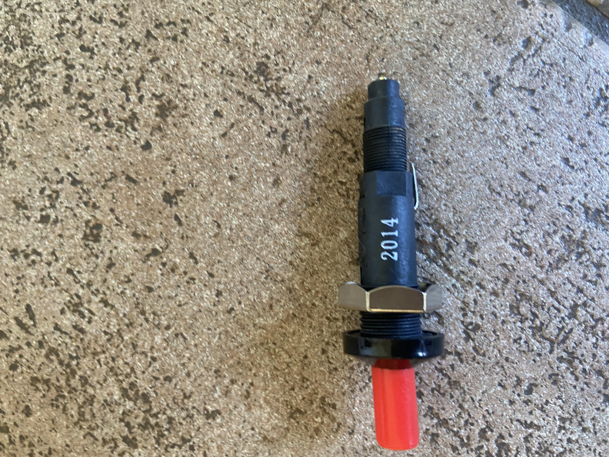
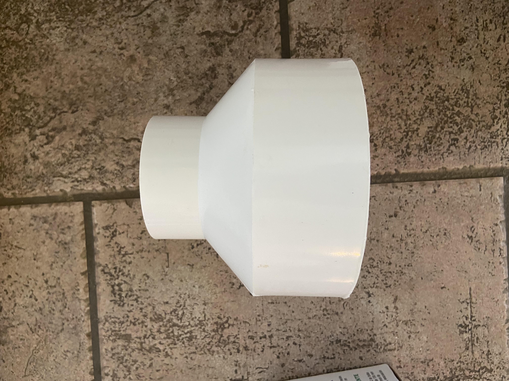

# Jude & Harry's Engineering 4 Project

#### Our Problem is finding the speed at which a Potato Cannon shoots a potato.

- - - - - - - - - - - - - - - - - - - - - - - - - - - - - - - - - - - - - - - - - - - - - - - - - - - - - - - - - - - - - - - - - - - - - - - - - - - - - - - - - - - - - 

### What is a Potato Cannon?

Potato Cannons are small scale projectile launchers. They function by utilizing Air Pressure to accelerate a projectile through a launch tube. There are different types of Potato Cannons, but we are building a **Combustion Driven Potato Cannon.**

> In this type of Potato Cannon, there is a combustion chamber and a launch tube. Before firing, propellant fills the combustion chamber, and is then ignited. For  > our project, we will be using a **Spark Plug** to ignite the propellant.

#### Propellents
Potato cannons can use a multitude of combustible fluids as "Fuel". 
This study does a great job of highlighting the benifits and drawbacks to very fuel. Although is seems that Acetylene is the clear winner, the drawbacks must be noted: the pressure caused by acetylene is immense and we are worried about it possibly breaking our PVC pipe.

##### Data
         

### For Reference
- - - - - - - - - - - - - - - - - - - - - - - - - - - - - - - - - - - - - - - - - - - - - - - - - - - - - - - - - - - - - - - - - - - - - - - - - - - - - - - - - - - - - 

Propellant  | Muzzle Velocity (MPH)
------------- | -------------
Acetylene  | 308.9 MPH
**Propane**  | **62.4 MPH**
Ethanol  | 74.5 MPH
Methanol  | 107.8 MPH
**Butane**  | **77.6 MPH**

Through research we've found that we can get Propane and Butane in spray cans, we may be able to access Ethanol or Methanol, but Acetylene is very expensive.
We will probably test both Propane and Butane on seperate launches after we get them.

**1 cc (Cubic Centimeter) = 1 mL (Milliliter)**

**1 mL of Butane = .599 g (grams)**                                                                                                                         
**1 mL of Propane = .583 g**

### Study
https://www.researchgate.net/publication/236627568_Studying_the_Internal_Ballistics_of_a_Combustion_Driven_Potato_Cannon_using_High-speed_Video

### Our Needs
We created a google doc outlining all the parts needed for this project. We included links for the parts we need to order aswell as a total estimated price. 

https://docs.google.com/document/d/1U25AbGJkagLkQlCdeDqdo1v5hj71Pqpnpsxfc6KjWwY/edit?usp=sharing
#### What we have as of now
Recently Harry went to Lowes and picked up the following parts :
- PVC cement and primer          
- 2 inch PVC pipe                
- Spark plug                     
- 2-4 inch Coupler               

### Potential Issues

Currently, We're three weeks out from the end of school. We are almost fully done with the building of the Potato Cannon, and we 3d printed a part so we can put the Pi in the Cannon. Our potato cannon currently is made out of 2 inch PVC on the barrel, and that might not be big enough to fit our Pi, as we 3d printed a spud and it fits but with the wiring it might not. We're contemplating whether moving to 3 inch PVC on the barrel will also be better.

Another one of our potential problems stems from the fact that since an explosion is happening in the cannon, the PVC may not withstand the blast. Whether that be heat, or when it is shot it might break. We plan on testing later this week to determine if this is fact or not.

